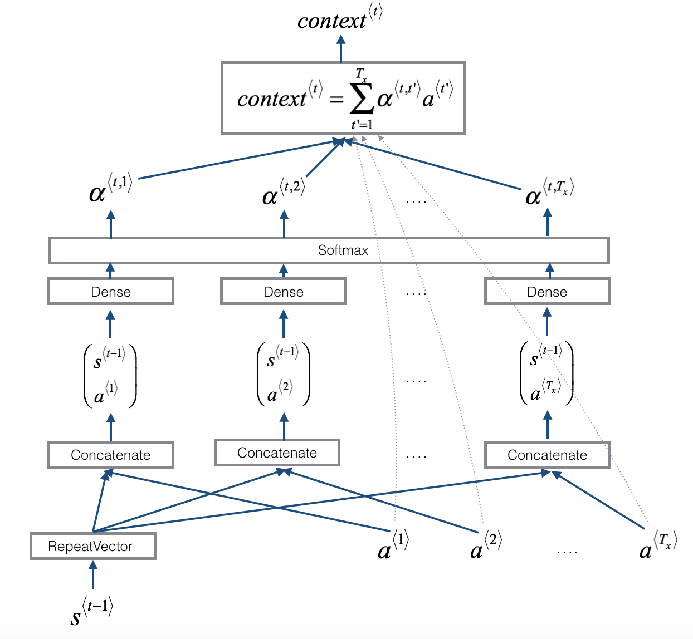

# NeuralMachineTranslation

This repository is the implementation of a Neural Machine Translation (NMT) model to translatehuman-readable dates ("25th of June, 2009") into machine-readable dates ("2009-06-25") using an attention model, one of the most sophisticated sequence-to-sequence models.

## Dataset

The model is trained on a dataset of 10,000 human readable dates and their equivalent, standardized, machine readable dates.

## Attention Mechanism

The attention mechanism tells a Neural Machine Translation model where it should pay attention to at any step. 

Here is a figure that shows how the model works. 
   * The diagram on the left shows the attention model. 
   * The diagram on the right shows what one "attention" step does to calculate the attention variables.
   * The attention variables $\alpha^{\langle t, t' \rangle}$ are used to compute the context variable.
   
<table>
<td> 
 <br>
</td> 
<td> 
 <br>
</td> 
</table>

## Setup

1. Clone this repository
```shell
git clone https://github.com/abel-shimeles/NeuralMachineTranslation.git
cd NeuralMachineTranslation
```

2. Open the [Neural_Machine_Translation_with_Attention](Neural_Machine_Translation_with_Attention.ipynb) file.
